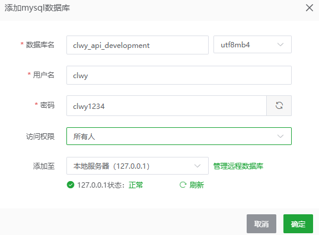

# clwy-api 学习笔记
## 使用 nvm 安装 Node.js
- 下载 `nvm-setup.exe` 并安装，下载地址： https://github.com/coreybutler/nvm-windows/ 。
- 运行 `nvm -v` ，测试安装是否成功。
- 运行 `nvm list available` ，找到最新的 Node.js 长期支持版本号(LTS) 。
- 运行 `nvm install 版本号` ，安装 Node.js 。
- 运行 `nvm use 版本号` ，将这个版本设置为默认版本。
- 运行 `node -v`，查看当前 Node.js 版本号。
- 补充，运行 `nvm list` ，看看现在已经安装了哪些版本的 Node.js 。
- 配置 npm 中国镜像，运行 `npm config set registry https://registry.npmmirror.com/
` 。
## 创建 Express 项目
- 安装 `express-generator` 脚手架，通过它，可以生成项目所需的结构。运行 `npm install -g express-generator` 。
- 运行 `express --no-view my-api ` ，创建项目 my-api ，`--no-view` 表示不需要视图模版，项目名称：my-api 。
- 进入项目目录，运行 `cd my-api` ，运行 `npm i` 安装项目依赖包，运行 `npm start` ，启动服务。
- 通过 `http://localhost:3000/` 来访问刚刚创建的 express 项目。
- 输出 `json` 格式。删除 `public\index.html` ，修改 `routes\index.js` ，重启服务。刷新浏览器，可以看到返回的 `json` 数据。
```javascript
var express = require('express');
var router = express.Router();

/* GET home page. */
router.get('/', function(req, res, next) {
    res.json({message: 'Hello Node.js'});
});

module.exports = router;
``` 
- 每次修改代码后，都需要重启服务，才能让新的代码生效，很麻烦。我们现在来安装 `nodemon` 包来解决这个问题。运行 `npm i nodemon` ，修改 `package.json` ，然后重启服务。
```json
{
  "name": "my-api",
  "version": "0.0.0",
  "private": true,
  "scripts": {
    "start": "nodemon ./bin/www"
  },
  "dependencies": {
    "cookie-parser": "~1.4.4",
    "debug": "~2.6.9",
    "express": "~4.16.1",
    "morgan": "~1.9.1",
    "nodemon": "^3.1.14"
  }
}
```
## 安装 MySQL
- 购买阿里云服务器，安装宝塔面板。
- 安装 MySQL 5.7.44
## 创建数据库

- 使用 DBeaver 测试连接。
